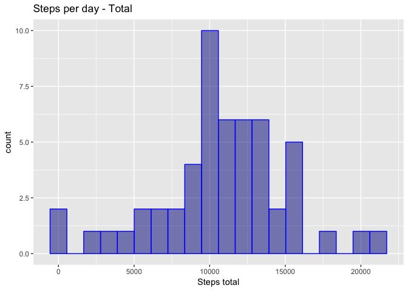
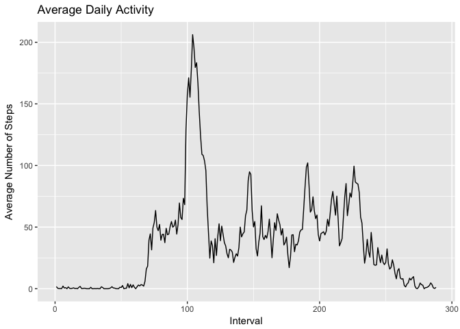
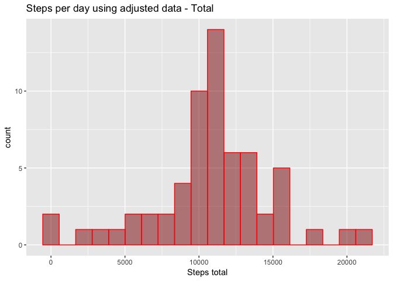
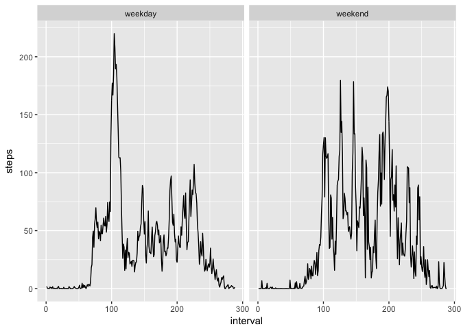

Introduction
------------

It is now possible to collect a large amount of data about personal movement using activity monitoring devices such as a Fitbit, Nike Fuelband, or Jawbone Up. These type of devices are part of the “quantified self” movement – a group of enthusiasts who take measurements about themselves regularly to improve their health, to find patterns in their behavior, or because they are tech geeks. But these data remain under-utilized both because the raw data are hard to obtain and there is a lack of statistical methods and software for processing and interpreting the data.

This assignment makes use of data from a personal activity monitoring device. This device collects data at 5 minute intervals through out the day. The data consists of two months of data from an anonymous individual collected during the months of October and November, 2012 and include the number of steps taken in 5 minute intervals each day.

Load and preprocessing the data
-------------------------------

### 1. Load the data

The file activity.csv should be located into a data folder inside your work directory

``` r
data_activity <- read.csv("./data/activity.csv", header = T, sep = ",")
```

### 2. Process/transform the data (if necessary) into a format suitable for your analysis

#### Data

The data for this assignment can be downloaded from the course web site.

The variables included in this dataset are:

-   steps: Number of steps taking in a 5-minute interval (missing values are coded as NA)

-   date: The date on which the measurement was taken in YYYY-MM-DD format

-   interval: Identifier for the 5-minute interval in which measurement was taken

The dataset is stored in a comma-separated-value (CSV) file and there are a total of 17,568 observations in this dataset.

-   Looking the number of records and columns

``` r
dim(data_activity)
```

    ## [1] 17568     3

-   Looking the records

``` r
head(data_activity)
```

    ##   steps       date interval
    ## 1    NA 2012-10-01        0
    ## 2    NA 2012-10-01        5
    ## 3    NA 2012-10-01       10
    ## 4    NA 2012-10-01       15
    ## 5    NA 2012-10-01       20
    ## 6    NA 2012-10-01       25

``` r
tail(data_activity)
```

    ##       steps       date interval
    ## 17563    NA 2012-11-30     2330
    ## 17564    NA 2012-11-30     2335
    ## 17565    NA 2012-11-30     2340
    ## 17566    NA 2012-11-30     2345
    ## 17567    NA 2012-11-30     2350
    ## 17568    NA 2012-11-30     2355

-   Summary of the data

``` r
summary(data_activity)
```

    ##      steps                date          interval     
    ##  Min.   :  0.00   2012-10-01:  288   Min.   :   0.0  
    ##  1st Qu.:  0.00   2012-10-02:  288   1st Qu.: 588.8  
    ##  Median :  0.00   2012-10-03:  288   Median :1177.5  
    ##  Mean   : 37.38   2012-10-04:  288   Mean   :1177.5  
    ##  3rd Qu.: 12.00   2012-10-05:  288   3rd Qu.:1766.2  
    ##  Max.   :806.00   2012-10-06:  288   Max.   :2355.0  
    ##  NA's   :2304     (Other)   :15840

``` r
str(data_activity)
```

    ## 'data.frame':    17568 obs. of  3 variables:
    ##  $ steps   : int  NA NA NA NA NA NA NA NA NA NA ...
    ##  $ date    : Factor w/ 61 levels "2012-10-01","2012-10-02",..: 1 1 1 1 1 1 1 1 1 1 ...
    ##  $ interval: int  0 5 10 15 20 25 30 35 40 45 ...

-   Format date column to Date format and interval column to Factor format

``` r
data_activity$date <- as.Date(data_activity$date, format = "%Y-%m-%d")
data_activity$interval <- factor(data_activity$interval)
str(data_activity)
```

    ## 'data.frame':    17568 obs. of  3 variables:
    ##  $ steps   : int  NA NA NA NA NA NA NA NA NA NA ...
    ##  $ date    : Date, format: "2012-10-01" "2012-10-01" ...
    ##  $ interval: Factor w/ 288 levels "0","5","10","15",..: 1 2 3 4 5 6 7 8 9 10 ...

Now we have the data formated to be used.

What is mean total number of steps taken per day?
-------------------------------------------------

*For this part of the assignment, you can ignore the missing values in the dataset.* \#\#\# 1. Calculate the total number of steps taken per day. The information will be stored at steps\_days\_total variable

``` r
steps_days_total  <- aggregate(steps ~ date, data = subset(data_activity, !is.na(steps)), sum )
```

### 2. Make a histogram of the total number of steps taken each day

``` r
library(ggplot2)
```

    ## Warning: package 'ggplot2' was built under R version 3.3.2

``` r
ggplot(steps_days_total, aes(steps)) + 
      geom_histogram(bins = 20, col = "blue", fill = "Dark blue", alpha = .5) +
      labs(title="Steps per day - Total") +
      labs(x="Steps total", y="count")
```

 \#\#\# 3. Calculate and report the mean and median of the total number of steps taken per day

``` r
mean(steps_days_total$steps)
```

    ## [1] 10766.19

``` r
median(steps_days_total$steps)
```

    ## [1] 10765

What is the average daily activity pattern?
-------------------------------------------

### 1. Make a time series plot (i.e. 𝚝𝚢𝚙𝚎 = "𝚕") of the 5-minute interval (x-axis) and the average number of steps taken, averaged across all days (y-axis)

``` r
steps_interval_mean  <- aggregate(steps ~ interval, data = subset(data_activity, !is.na(steps)), mean )
ggplot(steps_interval_mean, aes(x=as.numeric(interval), y=steps)) + geom_line() + labs(title="Average Daily Activity") + labs(x="Interval", y="Average Number of Steps")
```



### 2. Which 5-minute interval, on average across all the days in the dataset, contains the maximum number of steps?

``` r
steps_interval_mean[order(-steps_interval_mean$steps)[1],1]
```

    ## [1] 835
    ## 288 Levels: 0 5 10 15 20 25 30 35 40 45 50 55 100 105 110 115 120 ... 2355

The interval with the max numbers of steps is: 835

Imputing missing values
-----------------------

*Note that there are a number of days/intervals where there are missing values (coded as 𝙽𝙰). The presence of missing days may introduce bias into some calculations or summaries of the data.*

### 1. Calculate and report the total number of missing values in the dataset (i.e. the total number of rows with 𝙽𝙰s)

``` r
sum(!complete.cases(data_activity))
```

    ## [1] 2304

The total number of missing values is 2304

### 2. Devise a strategy for filling in all of the missing values in the dataset. The strategy does not need to be sophisticated. For example, you could use the mean/median for that day, or the mean for that 5-minute interval, etc.

*I choose to apply the mean values for the 5-minute interval*

``` r
data_na <- data_activity[!complete.cases(data_activity),2:3]
data_na <- merge(data_na, steps_interval_mean, by = "interval")
```

### 3. Create a new dataset that is equal to the original dataset but with the missing data filled in.

``` r
data_adjusted <- rbind(data_activity[complete.cases(data_activity),], data_na)
data_adjusted <- data_adjusted[order(data_adjusted$date, data_adjusted$interval),]
summary(data_adjusted)
```

    ##      steps             date               interval    
    ##  Min.   :  0.00   Min.   :2012-10-01   0      :   61  
    ##  1st Qu.:  0.00   1st Qu.:2012-10-16   5      :   61  
    ##  Median :  0.00   Median :2012-10-31   10     :   61  
    ##  Mean   : 37.38   Mean   :2012-10-31   15     :   61  
    ##  3rd Qu.: 27.00   3rd Qu.:2012-11-15   20     :   61  
    ##  Max.   :806.00   Max.   :2012-11-30   25     :   61  
    ##                                        (Other):17202

### 4. Make a histogram of the total number of steps taken each day and Calculate and report the mean and median total number of steps taken per day. Do these values differ from the estimates from the first part of the assignment? What is the impact of imputing missing data on the estimates of the total daily number of steps?

``` r
steps_days_total_adj  <- aggregate(steps ~ date, data = subset(data_adjusted, !is.na(steps)), sum )
ggplot(steps_days_total_adj, aes(steps)) + 
      geom_histogram(bins = 20, col = "red", fill = "Dark red", alpha = .5) +
      labs(title="Steps per day using adjusted data - Total") +
      labs(x="Steps total", y="count")
```



``` r
mean(steps_days_total_adj$steps)
```

    ## [1] 10766.19

``` r
median(steps_days_total_adj$steps)
```

    ## [1] 10766.19

Comparing the average values, the diference in use the NA records as average and not use those records is 0 step(s) Comparing the median values, the diference in use the NA records as average and not use those records is -1 step(s)
\#\# Are there differences in activity patterns between weekdays and weekends? For this part the 𝚠𝚎𝚎𝚔𝚍𝚊𝚢𝚜() function may be of some help here. Use the dataset with the filled-in missing values for this part.

``` r
data_adjusted$day_type <- as.factor(ifelse(weekdays(data_adjusted$date) %in% c("Sabado", "Domingo"), "weekend", "weekday"))
data_weekend <- aggregate(steps ~ interval + day_type, data = subset(data_adjusted, day_type == "weekend"), mean )

data_weekday <- aggregate(steps ~ interval + day_type, data = subset(data_adjusted, day_type == "weekday"), mean )

data_allweek <- rbind(data_weekend, data_weekday)
data_allweek$interval <- as.numeric(data_allweek$interval)
data_allweek$day_type <- as.character(data_allweek$day_type)

ggplot(data_allweek, aes(x=interval, y=steps)) + geom_line() + facet_grid(.~day_type) 
```


